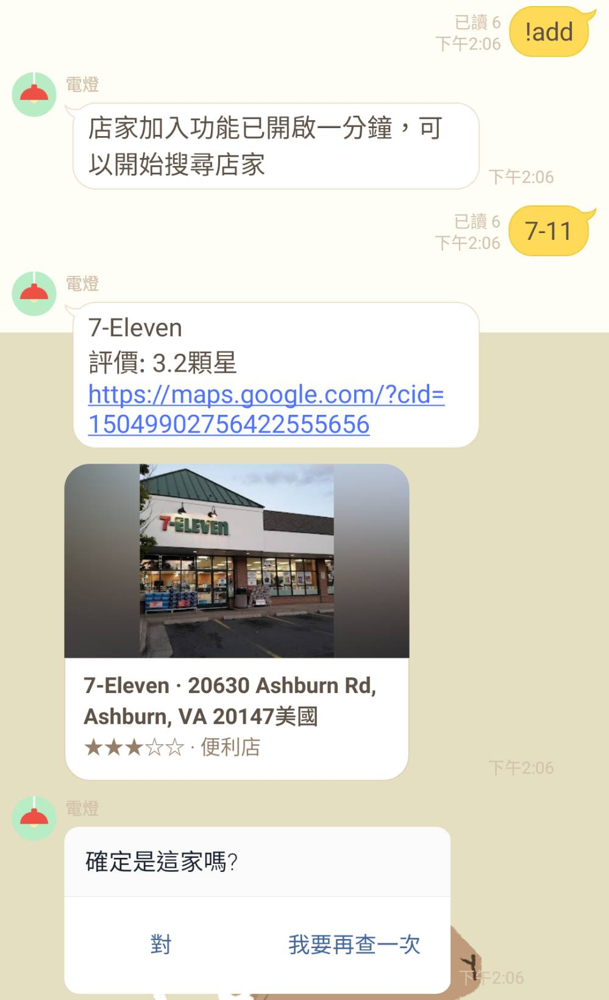
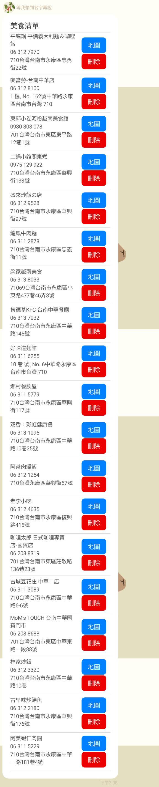
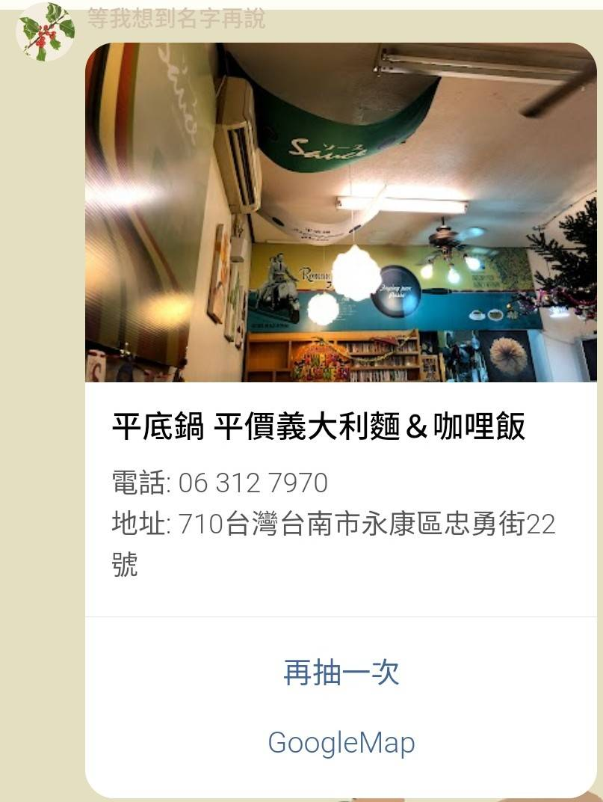

# Line抽午餐機器人

*用Django架的Line機器人，**群組**專用*

誒！中午要吃什麼，不知道，那抽個吧！

常常中午跟同事不知道要吃啥，乾脆寫一隻機器人丟在群組抽午餐用

### 指令

1.  成為機器人管理員 - **!admin**
   - 先搶先贏，管理員才可以開啟新增功能跟刪除餐廳（原本想說寫入刪除這種權限應該不能亂給，現在用起來看起來我多慮了）
   - 只能有一位管理員，~~也許未來會寫更改的功能，或者刪掉~~
2. 開啟新增店家資訊功能 - **!add**
   - 開啟一分鐘的Google地圖搜尋功能，群組所有打得字都會呼叫GoogleMap的API
   
     
   
   - 因為任何字句都會變成在搜尋又會維持這個樣子一分鐘，所以可以輸入 **!取消** 把這個功能停掉
3. 管理店家列表 - **!ls**
   - 看目前該群組儲存的店家列表，覺得不好吃或者怎樣就刪掉
   
       
   
   - ~~Line一次回覆的上限有一定字數上限，存太多家應該會導致字數爆掉顯示不出來，要再弄個分頁顯示之類的~~
4.  抽店家 - **!吃**
    - 就抽就對了，不喜歡就再抽一家，抽到爽為止
    
        
    
    - 地圖按鈕直接導到GoogleMap讓你看一下有沒有開之類的

### 會需要用到的東西

1. [Google Place API](https://developers.google.com/maps/documentation/places/web-service/overview)
   - 要收費，完全免費的話要把一些要求的資訊拿掉

2. MySQL

3. Redis